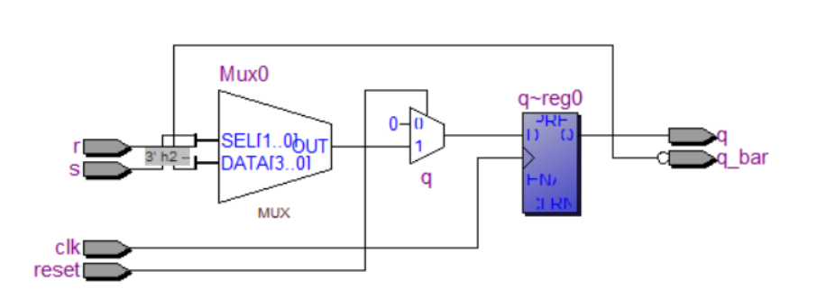

# SR-FLIPFLOP-USING-CASE

**AIM:**

To implement  SR flipflop using verilog and validating their functionality using their functional tables

**SOFTWARE REQUIRED:**

Quartus prime

**THEORY**

SR Flip-Flop SR flip-flop operates with only positive clock transitions or negative clock transitions. Whereas, SR latch operates with enable signal. The circuit diagram of SR flip-flop is shown in the following figure.

 
This circuit has two inputs S & R and two outputs Qtt & Qtt’. The operation of SR flipflop is similar to SR Latch. But, this flip-flop affects the outputs only when positive transition of the clock signal is applied instead of active enable. The following table shows the state table of SR flip-flop.

 
Here, Qtt & Qt+1t+1 are present state & next state respectively. So, SR flip-flop can be used for one of these three functions such as Hold, Reset & Set based on the input conditions, when positive transition of clock signal is applied. The following table shows the characteristic table of SR flip-flop. Present Inputs Present State Next State

 
By using three variable K-Map, we can get the simplified expression for next state, Qt+1t+1. The three variable K-Map for next state, Qt+1t+1 is shown in the following figure.

 
The maximum possible groupings of adjacent ones are already shown in the figure. Therefore, the simplified expression for next state Qt+1t+1 is Q(t+1)=S+R′Q(t)Q(t+1)=S+R′Q(t)

**Procedure**

/* write all the steps invloved */

**PROGRAM**

/* Program for flipflops and verify its truth table in quartus using Verilog programming. 
Developed by: RAMESH RENUKA
RegisterNumber: 212223240136

module SRFLIPFLOPUSINGCASE(q, q_bar, s,r, clk, reset);//SR Flip Flop Behavioral Level using ‘case’ 
  input s,r,clk, reset;
  output reg q;
  output q_bar;
 
  always@(posedge clk) begin // for synchronous reset
    if(!reset)       q <= 0;
    else 
  begin
      case({s,r})       
	     2'b00: q <= q;		  // No change
        2'b01: q <= 1'b0;	  // Write logic for reset
        2'b10: q <= 1'b1;    // Write logic for set
        2'b11: q <= 1'bx;    // Write logic for Invalid state
      endcase
    end
  end
  assign q_bar = ~q;
endmodule
*/

**RTL LOGIC FOR FLIPFLOPS**

**TIMING DIGRAMS FOR FLIP FLOPS**

**RESULTS**
Thus the program to implement a SR flipflop using verilog and validating their functionality using their functional tables is successfully completed.